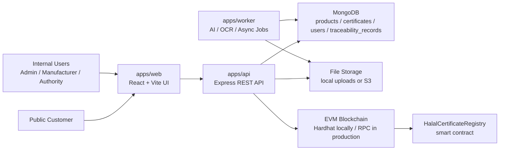
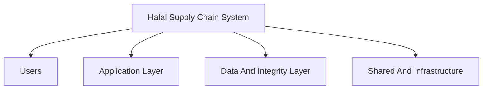
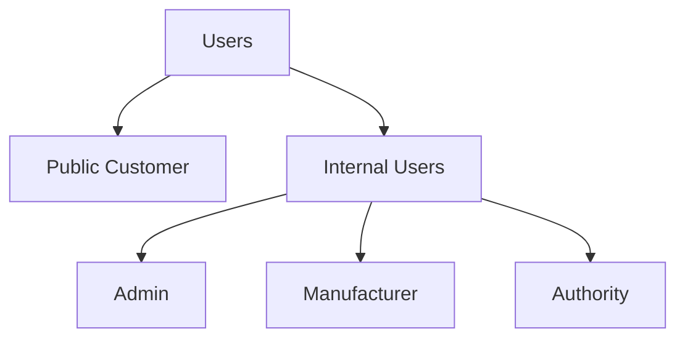
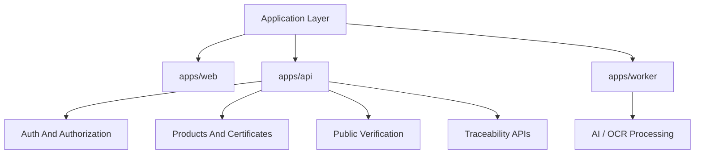
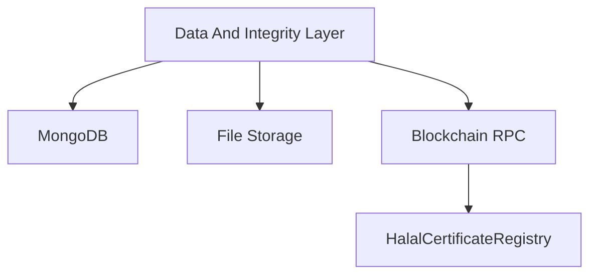
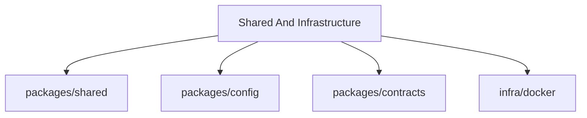

# Halal Supply Chain Architecture

## Monorepo Layout

- `apps/api`: Express REST API, MongoDB persistence, auth, review workflow, blockchain sync
- `apps/web`: React + Vite internal dashboard and public verification UI
- `apps/worker`: background AI verification processor
- `packages/shared`: shared DTOs, enums, and Zod validation schemas
- `packages/config`: environment parsing and defaults
- `packages/contracts`: Hardhat project and Solidity contract
- `infra/docker`: local container orchestration

## High-Level Blocks

## System Hierarchy Overview

## Users Hierarchy

## Application Layer Hierarchy

## Data And Integrity Hierarchy

## Shared And Infrastructure Hierarchy

## Hierarchy Block Explanations

### System Hierarchy Overview

- `Halal Supply Chain System`: the full platform that combines user-facing tools, backend services, storage, and blockchain integrity checks.
- `Users`: the human actors who interact with the system either internally or through public verification.
- `Application Layer`: the runtime services that execute the business workflow.
- `Data And Integrity Layer`: the persistence and proof layer that stores operational data and blockchain anchors.
- `Shared And Infrastructure`: the common packages and local infrastructure support that make the application stack run consistently.

### Users Blocks

- `Public Customer`: the external consumer who verifies a product by product reference or QR code and has read-only access.
- `Internal Users`: authenticated business and regulatory users who create products, upload certificates, review records, and maintain traceability.
- `Admin`: the internal control role that manages users, oversees operations, and can access the full dashboard workflow.
- `Manufacturer`: the role that creates product records, uploads halal certificates, and contributes operational traceability data.
- `Authority`: the halal or regulatory review role that validates certificates and performs the final approval or rejection step.

### Application Layer Blocks

- `apps/web`: the React and Vite frontend used for internal dashboard actions and the public verification interface.
- `apps/api`: the main backend service that handles authentication, validation, repository access, file handling, business rules, and blockchain writes.
- `apps/worker`: the asynchronous background service that processes pending certificates outside the synchronous request cycle.
- `Auth And Authorization`: the API module that validates JWT sessions, enforces role rules, and protects internal routes.
- `Products And Certificates`: the API domain flow that manages product creation, certificate upload, certificate review, and product-to-certificate linkage.
- `Public Verification`: the API and web path that exposes the final verification view for customers without requiring login.
- `Traceability APIs`: the backend endpoints that create and fetch traceability records linked to a product and batch.
- `AI / OCR Processing`: the worker-owned review stage that inspects uploaded certificate data and records AI verdict, score, and reasoning.

### Data And Integrity Blocks

- `MongoDB`: the operational database that stores products, certificates, users, and detailed traceability documents.
- `File Storage`: the location where uploaded certificate files and other binary assets are persisted, either locally or in S3-compatible storage.
- `Blockchain RPC`: the connection point the API uses to talk to an EVM network such as local Hardhat or a production RPC provider.
- `HalalCertificateRegistry`: the smart contract that stores certificate decision anchors and traceability hashes as tamper-resistant proofs.

### Shared And Infrastructure Blocks

- `packages/shared`: shared DTOs, enums, validation schemas, and common types used by the API, worker, and web app.
- `packages/config`: centralized environment loading and validation so all services resolve configuration consistently.
- `packages/contracts`: the Hardhat-based smart contract workspace that contains Solidity source, tests, deployment scripts, and contract tooling.
- `infra/docker`: local infrastructure definitions used to run supporting services such as MongoDB during development.

## Ownership By Block

- `apps/web` owns user interaction for internal operations and public verification lookup.
- `apps/api` is the system orchestrator. It owns authentication, validation, Mongo persistence, file handling, QR/verification responses, and blockchain writes.
- `apps/worker` owns asynchronous certificate processing after upload. It moves pending certificates through the AI review stage.
- `MongoDB` is the operational system of record for products, users, certificates, and full traceability records.
- `File Storage` holds uploaded certificate files and other binary assets.
- `Blockchain` holds tamper-resistant anchors for approved certificate decisions and traceability hashes.

## Production Mongo Compatibility

The production JSON schema files in the repo root remain the storage source of truth.

Implementation rule:
- Mongo models preserve field names exactly as exported, including `ProductID`, `BlockchainTxID`, `CreatedAt`, and related uppercase keys.
- Repository mappers convert those document shapes into app-facing camelCase DTOs.
- No storage-field renames are introduced in this MVP.

## Workflow

1. Internal user creates a product.
2. Manufacturer uploads a halal certificate.
3. API stores the file and certificate metadata with `PENDING_AI`.
4. Worker processes pending certificates and sets AI verdict, score, and reasoning.
5. Authority approves or rejects the certificate.
6. API records the final certificate decision on-chain.
7. API records traceability anchors on-chain when trace steps are created.
8. Public verification endpoint exposes product, certificate, traceability, and blockchain status.

## On-Chain Vs Off-Chain

On-chain:
- final certificate decision anchor
- certificate hash
- certificate authority and decision timestamp
- traceability record hash anchors

Off-chain:
- full product document
- full certificate metadata and file path
- full traceability details
- users, auth, and dashboard state

## Reasoning

- MongoDB remains the practical operational database because the system needs queryable mutable business data.
- Blockchain is used as an integrity layer, not as the full application database.
- The worker is separated so OCR and AI verification do not block synchronous user requests.
